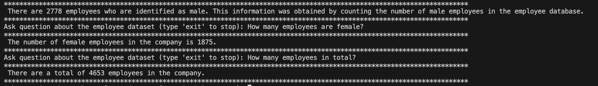

## Installation virtual environment

```
python3 -m pip install virtualenv
python3 -m virtualenv -p python3 .venv
```

## Activate the virtual environment

```
source .venv/bin/activate
export $(xargs < .env)
```

## Install dependencies

```
pip install -r requirements.txt
```

## Install Enviroment Variables
create a file call .env and include the inference url of a model of your choice
```
INFERENCE_URL=https://xxx.xxx.xxx.xxx/generate
```

## Run Script 

```
python main.py
```

## Sample questions 

```
How many employees are male?
How many employees are female?
How many employees in total?
```
